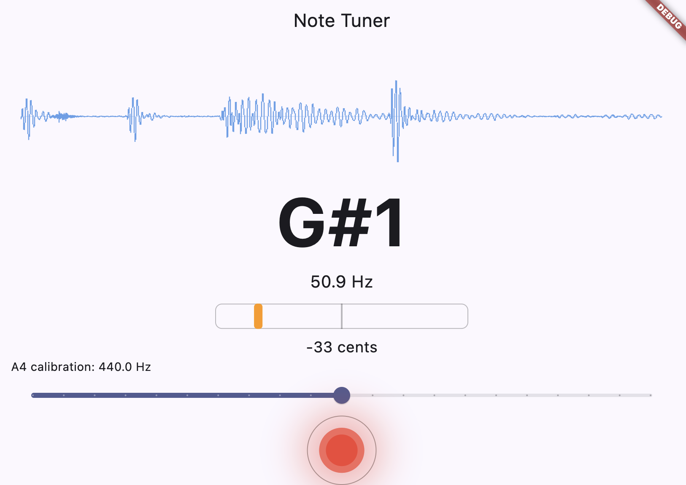
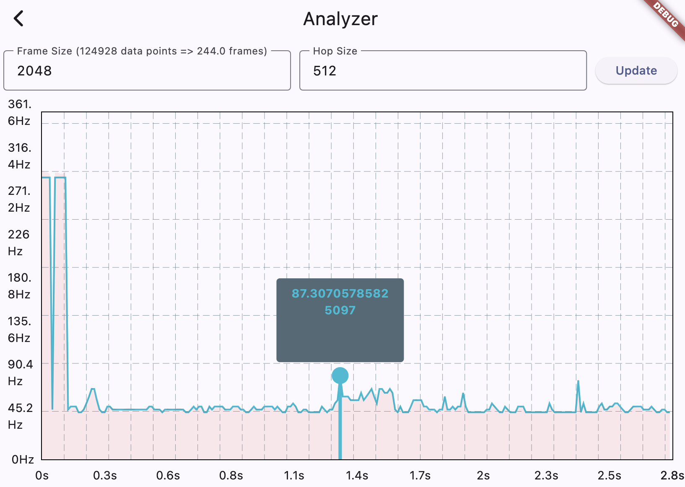

# mucron

GUI tuner & pitch detector. Currently works on Linux & macOS.

## Usage
Clone the repository
```bash
git clone https://github.com/winkt0/mucron.git
````

Then cd into it and execute flutter run:
```bash
cd mucron
flutter run
```

On macOS, you may be prompted to select the device to run the application on. Select the number associated with macOS (1 per default).

You should be greeted with a screen that looks something like this:



By pressing the red button, you can then record the microphone input, after which pYIN will be applied to the recorded audio and displayed as a list of frequency blocks:

